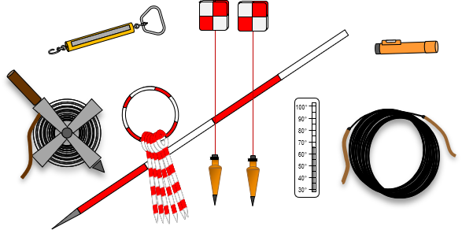
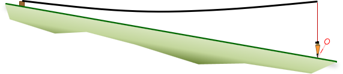
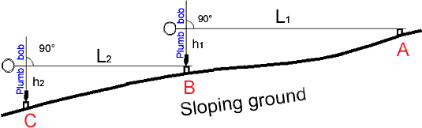
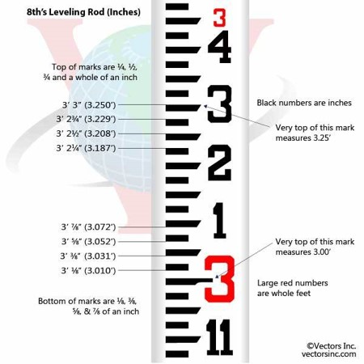
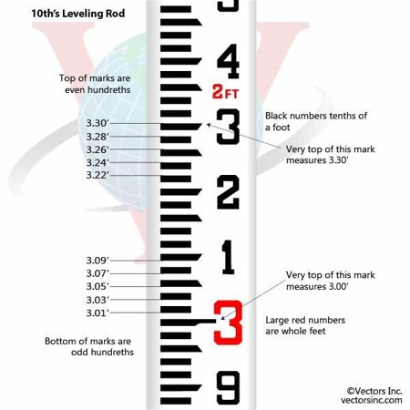
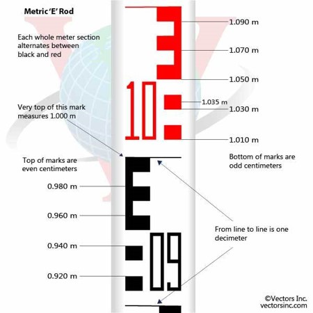
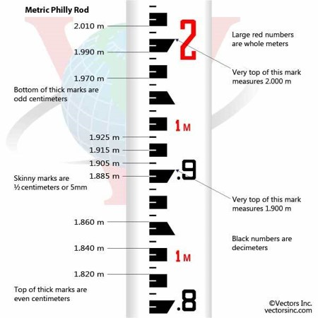
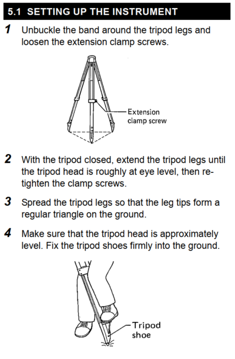
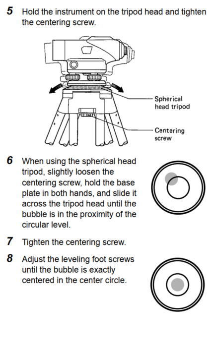

```{r setup, include=FALSE, cache=FALSE}
options(htmltools.dir.version = FALSE)
knitr::opts_chunk$set(cache = FALSE, dev = 'svg', echo = TRUE, message = FALSE, warning = FALSE,
                      fig.height=6, fig.width = 1.777777*6)
library("leaflet")
#library('leaflet.extra')
library('ggplot2')
library('purrr')
library("tibble")
#library('gganimate')
library('tidyr')
library("knitr")
library("viridis")
library('readr')
library('dplyr')
library(tidyverse)
library(fontawesome) # from github: https://github.com/rstudio/fontawesome
library(DiagrammeR)
## plot defaults
theme_set(theme_minimal(base_size = 16, base_family = 'Fira Sans'))
## constants
anim_width <- 1000
anim_height <- anim_width / 1.77777777
anim_dev <- 'png'
anim_res <- 200
```


class: center, middle

#### Office Hours: 

SRE 407 (or Zoom) 

Thursday 10:00 am 12:00 pm

[`r fa(name = "paper-plane")` scasirati@ucmerced.edu](mailto:scasirati@ucmerced.edu)


---
class: left, middle

# Today's topics...

* Surveyors tape
* Surveyors rod
* Tripod setup
* Horizontal distances

---
class: center, middle
.center[


.caption[
Source: Jerry Mahun
]
]

---

class: center, middle
.center[

.caption[
Source: FAO
]
]
.center[

.caption[
Source:  Jerry Mahun
]
]

---

class: center, middle
.center[

.caption[
Source: Boeingconsult
]
]

---
class: center, top
# Surveyors Rods



---

class: center, top
# Other types of Rods (Metric)



---
class: center, top


---
#### Goal of the day:
- ###### Measure Horizontal Distances:
  - ###### Steel tapes
  - ###### Fiber Glass tapes
- ###### Setting up tripods and reading the rod

###### Study Area
```{r,echo=FALSE,warning=FALSE,message=FALSE,error=FALSE}
## To Convert Klm to shp using ogr2ogr -f 'ESRI Shapefile' output.shp input.kml
library(leaflet)
library(sf)
library(rgdal)
DistA<-readOGR("./Experiment/Polygons/","dist_A",verbose = FALSE)
DistB<-readOGR("./Experiment/Polygons/","dist_B",verbose = FALSE)
DistC<-readOGR("./Experiment/Polygons/","dist_C",verbose = FALSE)

m <- leaflet() %>% setView(-120.423625,37.365883,20) %>% 
  addProviderTiles(providers$Esri.WorldImagery) %>% 
  addPolygons(data=DistA,color = "red",weight = 2,opacity = 1) %>% 
  addPolygons(data=DistB,color = "yellow",weight = 2,opacity = 1) %>% 
  addPolygons(data=DistC,color = "blue",weight = 2,opacity = 1) %>% 
  #addTiles() %>%  # Add default OpenStreetMap map tiles
  addMarkers(lng=-120.423625, lat= 37.365883, popup="Benchmark : Lantern Statue \n elevation 208 Ft.")
m  # Print the map
```
---
class: center, middle

#### 5 Groups: 

Horizontal Distances 
======================================================================
| Path | Step | Measured distance | Unit | Date | Temperature | Method |
|:-----:|:-----:|:-----:|:-----:|:-----:|:-----:|:-----:|
|...|...|...|...|...|...|...|
|...|...|...|...|...|...|...|
|...|...|...|...|...|...|...|

---
class: center, middle

## ...Questions?


```{r, echo=FALSE,eval=FALSE}
library(renderthis)
build_pdf( "./Lab1_W1_2_tapes_rod_tripods/Lab1.html", complex_slides = TRUE, partial_slides = TRUE)
```